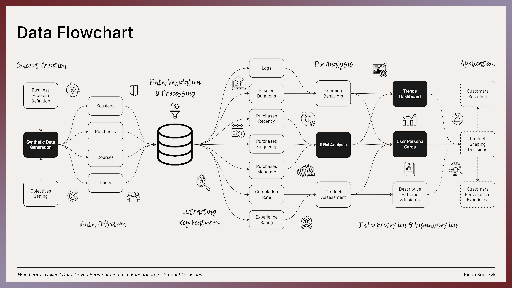
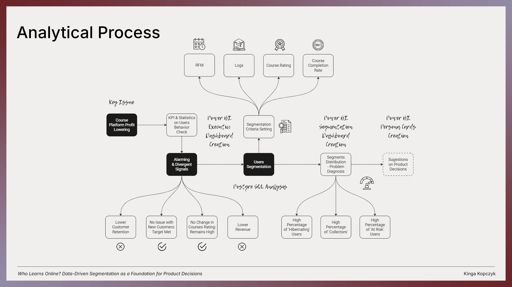
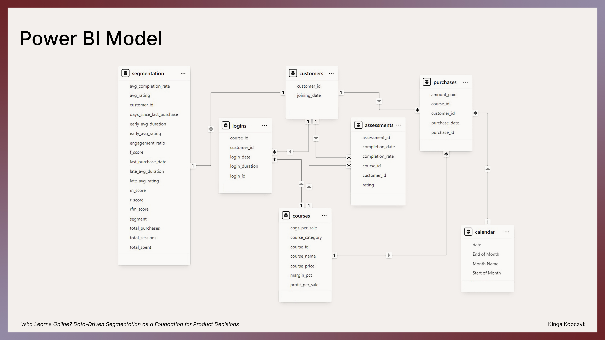
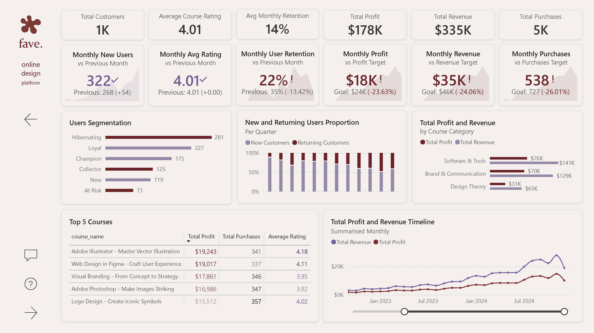
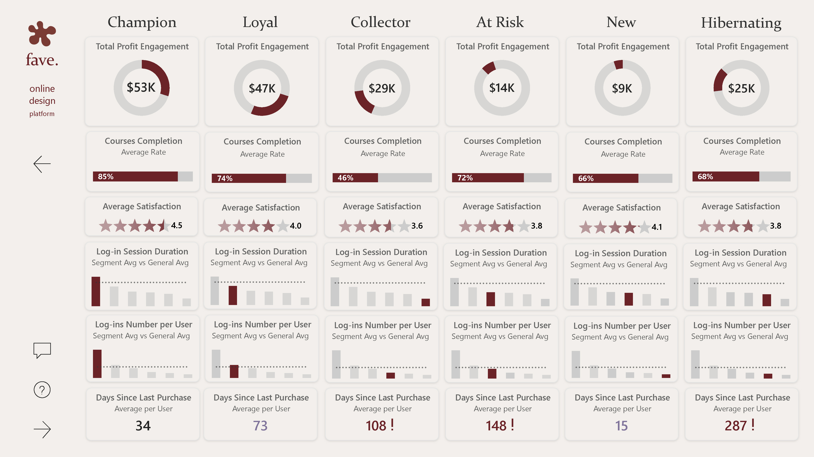
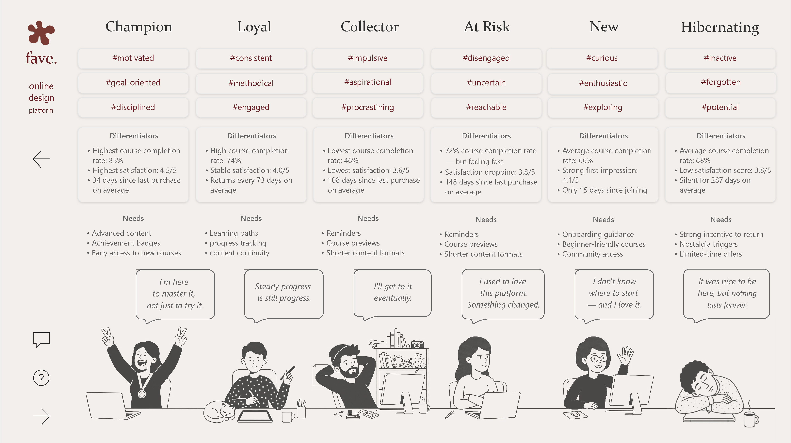

# Who Learns Online?
### Data-Driven Segmentation as a Foundation for Product Decisions

**Project 1 of 3 — Data Analytics Portfolio**

An e-learning platform is losing users — but doesn't know who, why, or when exactly. This project segments 1,000 customers of a fictional design-focused platform called **fave.** using RFM analysis enriched with behavioral data: course completion rates, session engagement, and satisfaction scores. The result is six actionable customer personas and a Power BI dashboard that translates raw behavioral data into retention strategy.



---

## Tools & Stack

| Layer | Tool |
|---|---|
| Synthetic data generation | Python · Faker |
| Database & analysis | PostgreSQL · SQL |
| Visualization | Power BI · DAX |
| Documentation | Markdown · GitHub |

---

## Project Structure

```
📁 who-learns-online/
│
├── 📄 README.md
│
├── 📁 data/
│   ├── 📁 data_generator/
│   │   └── online_design_platform_data_generator.ipynb
│   ├── 📁 generated_data/
│   │   ├── customers.csv
│   │   ├── courses.csv
│   │   ├── purchases.csv
│   │   ├── assessments.csv
│   │   └── logins.csv
│   └── 📁 sql_queries_results/
│       ├── segmentation.csv
│       └── segments_distribution.csv
│
├── 📁 sql/
│   ├── 01_data_validation.sql
│   ├── 02_rfm_scoring.sql
│   ├── 03_segmentation.sql
│   └── 04_segments_distribution.sql
│
├── 📁 power_bi/
│   ├── Course_Platform.pbix
│   ├── Course_Platform-1.jpg
│   ├── Course_Platform-2.jpg
│   └── Course_Platform-3.jpg
│
├── 📁 diagrams/
│   ├── who_learns_online_flowchart.jpg
│   ├── analytical_process.jpg
│   └── powerbi_model_architecture.jpg
│
└── 📁 graphics/
    ├── course_platform_logo.png
    └── persona_illustration.jpg
```

---

## Business Problem

A design e-learning platform is experiencing declining monthly revenue and retention. Course ratings remain high — meaning content quality is not the issue. This analysis investigates whether the root cause lies in user behavior: who is disengaging, and when.

**Analytical objectives:**
1. Explore current sales trends and platform-level KPIs
2. Verify changes in user behavior through login and session data
3. Segment users based on purchase history, course completion, session activity, and ratings
4. Diagnose the retention problem through segment size and behavioral signals
5. Propose data-driven product decisions for each customer segment



---

## Data

Synthetic data was generated using Python and the **Faker** library. The dataset simulates three years of platform activity (2022–2024) across five relational tables.

### Schema

```
customers     customer_id · joining_date
courses       course_id · course_name · course_category · course_price · cogs_per_sale
purchases     purchase_id · customer_id · course_id · purchase_date · amount_paid
assessments   assessment_id · customer_id · course_id · completion_rate · rating · completion_date
logins        login_id · customer_id · course_id · login_date · login_duration
```

### Course Catalogue

15 design courses across three categories:

| Category | Courses |
|---|---|
| Software & Tools | Adobe Illustrator, Adobe Photoshop, Adobe InDesign, Web Design in Figma, Canva |
| Design Theory | Animation from Scratch, Color Theory, Moodboard Creation, Book Cover Design, Typography Design |
| Brand & Communication | Logo Design, Presentation Design, Infographic Design, Visual Communication, Visual Branding |

### Behavioral Profiles

Each synthetic customer was assigned one of six behavioral profiles during generation. These profiles drove realistic variation in purchase frequency, completion rates, session duration, and ratings — and correspond to the segments recovered in the RFM analysis.

> **Note:** The `profile` column used during generation is not included in the final CSV files. It served only as an internal data quality check.

### Key Data Facts

| Metric | Value |
|---|---|
| Customers | 1,000 |
| Purchases | 5,217 |
| Login sessions | ~34,000 |
| Assessment records | ~3,800 |
| Date range | Jan 2022 – Dec 2024 |

---

## SQL Analysis

All analysis was performed in **PostgreSQL**. Queries are organized into four files reflecting the analytical workflow.

### 01 — Data Validation

Verifies referential integrity and data quality before analysis:
- Date consistency: no login before joining date, no completion before purchase
- NULL audit across all five tables (rating and completion_date are nullable by design)
- Orphaned record check: no assessment or login without a corresponding purchase

All validation queries returned 0 anomalies.

### 02 — RFM Scoring

Calculates Recency, Frequency, and Monetary scores for each customer:

- **Recency** — days since last purchase, scored 1–5 using manual CASE WHEN thresholds calibrated to the 3-year data range
- **Frequency** — total purchases, scored 1–5 using NTILE(5)
- **Monetary** — total amount paid, scored 1–5 using NTILE(5)

Manual thresholds were chosen for Recency over NTILE to reflect meaningful business time periods (30, 90, 180, 365 days) rather than arbitrary statistical quantiles. Following Hughes (1994), equal weight was assigned to all three dimensions.

### 03 — Behavioral Enrichment & Segmentation

Standard RFM does not capture post-purchase behavior. The RFM table is enriched with four additional dimensions before segment assignment:

- **avg_completion_rate** — average course completion per customer
- **avg_rating** — average satisfaction score per customer
- **engagement_ratio** — customer's average session duration relative to the course-level platform average (not the overall average, to account for natural differences in course format and complexity)
- **session_trend** — compares early vs. late session duration to detect declining engagement over time
- **rating_trend** — compares early vs. late ratings to detect growing dissatisfaction

> *"Segments are assigned based on RFM scores enriched with behavioral data — completion rate and session activity — to differentiate customers who buy but do not engage from those who actively learn."*

**Methodology reference:** Hughes, A.M. (1994). *Strategic Database Marketing*. Probus Publishing. / Fader, P.S., Hardie, B.G.S., & Lee, K.L. (2005). *"Counting Your Customers" the Easy Way.* Marketing Science, 24(2), 275–284.

### 04 — Segment Distribution

Verifies the final segment counts and proportions.

---

## Segmentation Results

| Segment | Customers | Share |
|---|---|---|
| Hibernating | 281 | 28.1% |
| Loyal | 227 | 22.7% |
| Champion | 175 | 17.5% |
| Collector | 125 | 12.5% |
| New | 119 | 11.9% |
| At Risk | 73 | 7.3% |

### Segment Definitions

**Champion** — Recent, frequent buyer who completes most courses (avg. 85% completion) and spends significantly more time per session than the platform average. Highest satisfaction score: 4.5/5.

**Loyal** — Regular, methodical learner returning every ~73 days on average. Solid completion rate of 74% and stable satisfaction of 4.0/5. Platform's most dependable revenue source.

**Collector** — Frequent buyer with completion below 55%. Purchases impulsively but rarely engages deeply with content. Satisfaction score of 3.6/5 — the lowest among active buyers.

**At Risk** — Previously engaged user showing at least one of three warning signals: absence of recent purchases, declining session duration (late sessions >25% shorter than early sessions), or dropping ratings (late avg >0.5 below early avg). Average 148 days since last purchase despite historically high activity.

**New** — Recently joined, still exploring. One or two purchases, 66% completion rate, and an above-average satisfaction score of 4.1/5 — a positive first impression that needs to be reinforced.

**Hibernating** — Long inactive, with an average of 287 days since last purchase. Despite a 28.1% share — the largest segment — their cumulative profit contribution of $25K represents significant untapped reactivation potential.


---

## Key Insights

**1. The platform has a strong engaged core — but nearly 1 in 3 customers has gone silent.**
Champion and Loyal together account for 40.2% of users and drive the majority of profit. Hibernating at 28.1% is the single largest segment and represents the platform's primary retention challenge.

**2. Revenue looks healthy on the surface, but trends are concerning.**
Monthly profit ($18K) is 23.6% below target, and monthly user retention dropped from 35% to 22% — a 13.4 percentage point decline month-over-month.

**3. Course ratings remain high across all segments — the product is not the problem.**
Average satisfaction ranges from 3.6 (Collector) to 4.5 (Champion). High ratings alongside declining retention suggest the issue is engagement and habit formation, not content quality.

**4. Collectors represent a conversion opportunity, not a lost cause.**
With frequent purchases but low completion, this segment is buying aspirationally. Shorter content formats and progress nudges could convert browsers into learners.

**5. At Risk users were once highly engaged.**
Their historical completion rate of 72% is higher than New (66%) and Hibernating (68%) — meaning they know how to use the platform. Re-engagement here is more efficient than acquisition.

---

## Power BI Dashboards

The `.pbix` file contains three dashboard pages.



### Page 1 — Executive Overview

Platform-level KPIs, monthly trends vs. targets, new vs. returning user proportion per quarter, top 5 courses by profit and rating, and profit breakdown by course category.



### Page 2 — Customer Segments

Per-segment metrics: total profit engagement, course completion rate, average satisfaction (star rating), log-in session duration vs. platform average, log-ins per user vs. platform average, and days since last purchase.



### Page 3 — Persona Cards

Six illustrated personas with behavioral keywords, differentiators, needs, and a defining quote. Personas are grounded in segmentation data and designed to inform product and retention decisions.



### DAX Measures

Key measures used across dashboards:

```dax
Total Revenue                 = SUM(purchases[amount_paid])
Total Cost                    = SUMX(purchases, RELATED(courses[cogs_per_sale]))
Total Profit                  = [Total Revenue] - [Total Cost]
Profit Margin %               = DIVIDE([Total Profit], [Total Revenue])
Previous Month Revenue        = CALCULATE([Total Revenue], DATEADD('calendar'[date], -1, MONTH))
Previous Month Profit         = CALCULATE([Total Profit], DATEADD('calendar'[date], -1, MONTH))
Previous Month Purchases      = CALCULATE([Total Purchases], DATEADD('calendar'[date], -1, MONTH))
Previous Month Average Rating = CALCULATE([Average Rating], DATEADD('calendar'[date], -1, MONTH))
Previous Month New Customers  = CALCULATE([New Customers], DATEADD('calendar'[date], -1, MONTH))
Average Rating                = AVERAGE(assessments[rating])
Avg Completion Rate           = AVERAGE(segmentation[avg_completion_rate])
Avg Miscompletion Rate        = 1 - AVERAGE(segmentation[avg_completion_rate])
Avg Recency                   = AVERAGE(segmentation[days_since_last_purchase])
Avg Segment Rating            = AVERAGE(segmentation[avg_rating])
Avg Segment Rating Gap        = 5 - AVERAGE(segmentation[avg_rating])
Avg Session Duration          = AVERAGE(segmentation[late_avg_duration])
Repeat Purchase Rate %        = DIVIDE([Returning Customers], DISTINCTCOUNT(purchases[customer_id]))
Profit Target                 = [Previous Month Profit] * 1.1
Purchases Target              = [Previous Month Purchases] * 1.1
Revenue Target                = [Previous Month Revenue] * 1.1
New Customers                 = DISTINCTCOUNT(purchases[customer_id]) - [Returning Customers]

Avg Monthly Repeat Purchase Rate % = 
AVERAGEX(
    VALUES('calendar'[Year Month]),
    [Repeat Purchase Rate %]
)

Previous Month Repeat Purchase Rate % = 
CALCULATE([Repeat Purchase Rate %], DATEADD('calendar'[date], -1, MONTH))

Platform Avg Session Duration = 
CALCULATE(
    DIVIDE(SUM(logins[login_duration]), DISTINCTCOUNT(logins[login_id])),
    REMOVEFILTERS(segmentation[segment])
)

Platform Avg Log-ins Number per User = 
CALCULATE(
    DIVIDE(COUNTROWS(logins), DISTINCTCOUNT(logins[customer_id])), 
    REMOVEFILTERS(segmentation[segment])
)

Returning Customers =
COUNTROWS(FILTER(
    SUMMARIZE(purchases, purchases[customer_id],
              "total_purchases", COUNT(purchases[purchase_id])),
    [total_purchases] > 1))

```

---

## How to Run

### 1. Generate synthetic data

Open `data/data_generator/online_design_platform_data_generator.ipynb` in Google Colab.
Run all cells — CSV files will be downloaded automatically.

### 2. Set up the database

In pgAdmin (or any PostgreSQL client), create a new database and import the five CSV files as tables: `customers`, `courses`, `purchases`, `assessments`, `logins`.

### 3. Run SQL analysis

Open the `sql/` folder in VS Code with the SQLTools extension connected to your PostgreSQL database.
Run files in order: `01` → `02` → `03` → `04`.

### 4. Explore the dashboard

Open `power_bi/Course_Platform.pbix` in Power BI Desktop.
The file uses a local data connection — you may need to update the data source path to point to your local CSV files.

---

## About

This project is part of a three-project data analytics portfolio built to demonstrate end-to-end analytical thinking — from data design and SQL analysis to business storytelling and visualization.

The other two projects in the portfolio:
- *From Irritation to Trust* — NLP & Sentiment Analysis of chatbot user interactions (Python)
- *Location Intelligence* — Spatial Scoring Model for Real Estate Investment Decisions (Python · GIS · ARIMA)

---

*Synthetic data. All platform names, figures, and personas are fictional and created for analytical purposes only.*
